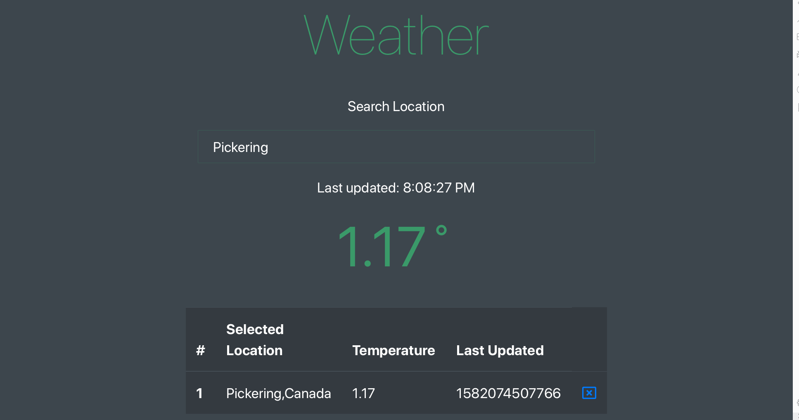

# Weather

###A weather app 
##built w/ React | Redux | Axios | jQuery | Bootstrap | Node.js | MongoDB | Darksky API | 


##Install, Build & Run instructions

clone it using:

```
git clone git@github.com:kipp0/Weather.git
```

then install dependencies using:

```
npm install
```

and finally run the application using:

```
npm run db
npm run api
npm start
```

Now you can check the weather near you by navigating to ```localhost:3000```!
